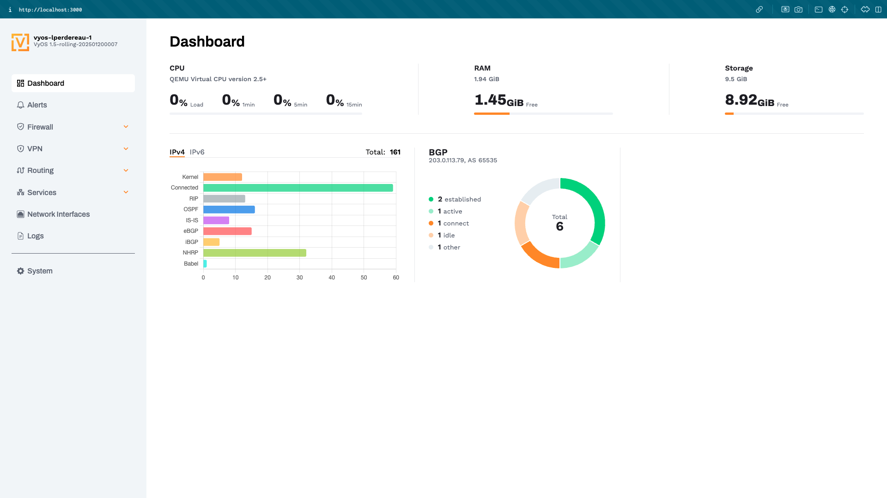
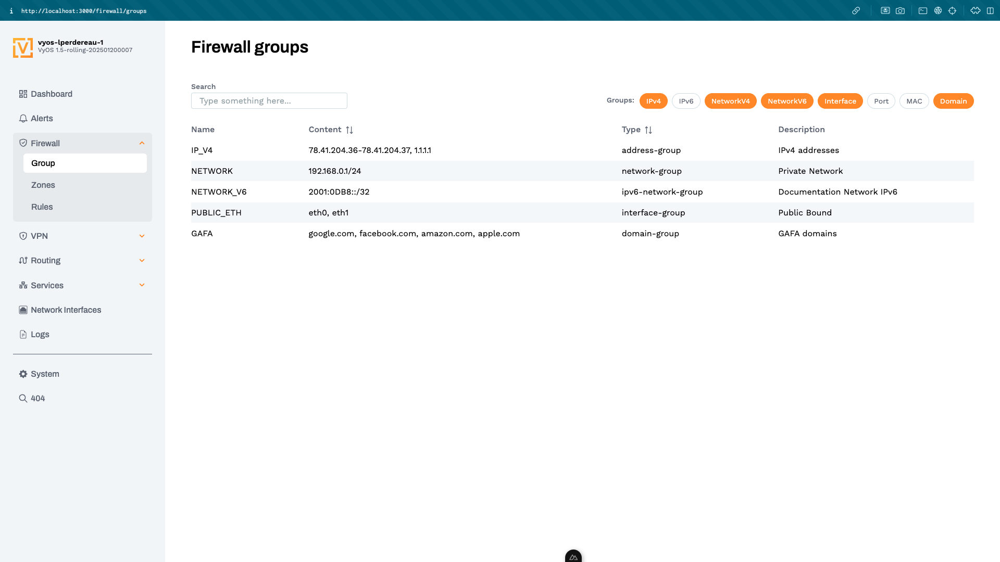

# VyOS UI

[](https://nuxt.com)
[](https://opensource.org/licenses/MIT)

VyOS UI is a implementation of Figma designs for VyOS, a network operating system based on Debian GNU/Linux. This project aims to provide a user-friendly web interface for managing VyOS configurations and settings.

[Figma Designs](https://www.figma.com/design/mgkpvjKunwWe1qDX3Tp1iF/VyOS-Local-UI?node-id=7114-58578&p=f&t=d3FLslxUr7KKm81J-0)

## ⚠️ Warning
This project is in early development and should not be used in production environments. It may contain bugs, incomplete features and not working as attended.


## Preview




## Setup Into VyOS
```
container {
    name ui {
        allow-host-networks
        environment NODE_TLS_REJECT_UNAUTHORIZED {
            value 0
        }
        /* Default value https://127.0.0.1/graphql */
        environment ENDPOINT {
            value https://127.0.0.1/graphql
        }
        image ghcr.io/lperdereau/vyos-ui:<version>
    }
}
```

## Setup with external docker engine
```shell
docker run -d \
    --name vyos-ui \
    --network host \
    -e NODE_TLS_REJECT_UNAUTHORIZED=0 \
    -e ENDPOINT=https://<vyos-ip>/graphql \
    ghcr.io/lperdereau/vyos-ui:<version>
```

## Development

Make sure to install dependencies:

```bash
# npm
npm install
```

Start the development server on `http://localhost:3000`:

```bash
# npm
npm run dev
```
